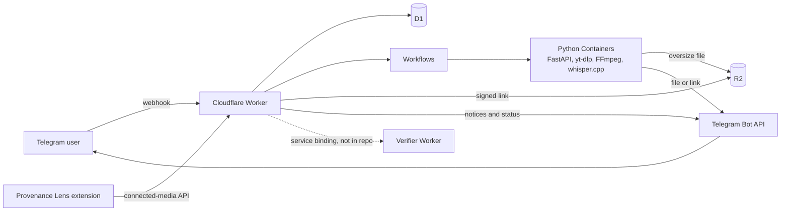

# DigiBot

[](https://github.com/Blimp3/digibot/actions/workflows/ci.yml)
[](https://github.com/Blimp3/digibot/actions/workflows/container.yml)
[](https://github.com/Blimp3/digibot/actions/workflows/secrets.yml)

DigiBot is a personal, invite-only Telegram media bot on Cloudflare. Send it a
public link, or use the companion browser extension, and you get the video,
audio, clip or transcript in your Telegram chat.

DigiBot uses a TypeScript Worker and a Python Container. Delivery is
idempotent. Network egress is safe from server-side request forgery (SSRF).
The project has about 1,300 automated tests.

## What it does

| Message | Result |
| --- | --- |
| `URL` | Video download (up to 1080p) |
| `/video URL [from 12:00 to 17:00]` | Choose 1080p, 720p, 480p or 360p. Optional trim. |
| `/audio URL [m4a\|mp3] [first 5 minutes]` | M4A or MP3 audio. Optional trim. |
| `/clips URL from 00:00 to 00:02; from 00:03 for 2 seconds` | 2–3 clips in one Telegram album |
| `/playlist URL [1-5]`, `/channel URL [1-5]` | The first items of a YouTube playlist or channel |
| `/transcript URL` | Markdown transcript with timestamps (Whisper small, sources up to 15 minutes) |
| `/captions URL [language]` | Publisher or automatic captions as Markdown |
| `/search phrase` as a reply to a transcript | Matching passages with timestamps |
| Reply `/audio` or `/video` to a Telegram file | Convert a file up to 20 MB |
| `/queue`, `/status`, `/stats`, `/activity` | Queue positions, outcomes and recent activity |

Access and delivery:

- DigiBot works only in private chats.
- Two allowlisted owners can use DigiBot. Users that the owners invite for the
  extension features can also use DigiBot.
- A Telegram Mini App shows history and statistics.
- If a file is larger than the Telegram upload limit, you get a private,
  signed link. The link expires after one hour.

## How it works



1. The Worker checks the webhook secret, the user allowlist and the URL. Then
   the Worker admits the request into a durable D1 queue in one transaction.
2. A Workflow, keyed by the job ID, moves the request through preparation
   steps that can retry. Then the request goes to one final delivery step.
   This step does not retry.
3. The downloader Container uses yt-dlp to probe and download the source. Then
   the Container uses FFmpeg and FFprobe to convert and verify the result. A second
   Container runs whisper.cpp for transcripts.
4. The result goes directly to Telegram. If a file is too large for Telegram,
   the file goes to a private R2 bucket. The user then gets a signed link that
   expires.

The connected-media API pairs DigiBot with the
[Provenance Lens browser extension](https://github.com/Blimp3/provenance-lens-extension)
(Lens). Lens can send a page link to DigiBot. Lens can also check images for
Content Credentials. For more information, see
[docs/architecture.md](docs/architecture.md) and
[docs/integration.md](docs/integration.md).

## Tech stack

- **Cloudflare:** Workers (TypeScript), Workflows, D1 (SQLite), R2, Containers (through Durable Object bindings), Wrangler
- **Media service:** Python 3.12, FastAPI, Uvicorn, Pydantic, HTTPX, boto3
- **Media tools:** yt-dlp (with yt-dlp-ejs and Deno), FFmpeg and FFprobe, whisper.cpp
- **Telegram:** Bot API (webhooks, multipart uploads, media groups, inline keyboards), Mini Apps
- **Testing and quality:** Vitest with Miniflare/workerd, pytest, mypy (strict), Ruff, ESLint, typescript-eslint
- **Tooling:** pnpm workspaces, uv, Docker (linux/amd64), GitHub Actions

## Engineering design

| Area | Design | Where the tests are |
| --- | --- | --- |
| Idempotency and replay safety | One D1 transaction reserves the Telegram update ID, the user's allowances and the queue entry. In a test, 100 concurrent duplicate updates admit exactly one job. Workflow steps and Container preparation can repeat without a second download or send. | [recovery-d1](apps/cloudflare-worker/tests/recovery-d1.test.ts), [workflow-replay](apps/cloudflare-worker/tests/workflow-replay.test.ts) |
| Delivery reconciliation | Telegram has no upload idempotency key. For this reason, the final send never retries automatically. DigiBot records an ambiguous send as unknown. A recovery job runs every minute. It uses generation-fenced leases and repairs D1 only from confirmed receipts. `/reconcile` checks the file hash before it records a lost receipt. | [dispatch](apps/cloudflare-worker/tests/dispatch.test.ts), [integration-telegram](apps/cloudflare-worker/tests/integration-telegram.test.ts), [test_telegram](apps/downloader-container/tests/test_telegram.py) |
| SSRF and egress controls | DigiBot uses an exact host allowlist with IDNA (Internationalized Domain Names for Applications) normalization. DigiBot rejects URLs with credentials. DigiBot also rejects URLs that point to private, loopback, link-local or metadata addresses. yt-dlp connects through a local egress proxy. The proxy resolves each host and connects only to a public IP. As a result, a DNS change cannot reach an internal address. | [test_egress_proxy](apps/downloader-container/tests/test_egress_proxy.py), [test_security](apps/downloader-container/tests/test_security.py), [url](apps/cloudflare-worker/tests/url.test.ts) |
| Bounded downloads and processes | DigiBot limits duration (2 h), source size (500 MB) and Telegram payload (49 MB, with a re-encode ladder). Subprocesses use argv arrays, absolute deadlines, output caps and process-group kill. Each job has its own workspace. The Container removes the workspace after delivery. | [test_workspace_process](apps/downloader-container/tests/test_workspace_process.py), [test_direct_media](apps/downloader-container/tests/test_direct_media.py) |
| Rate limits and queues | Each user has an hourly cap and at most five unfinished jobs. Downloads and transcripts use separate FIFO (first in, first out) lanes. Searches and playlist lookups have their own cooldowns. | [recovery-d1](apps/cloudflare-worker/tests/recovery-d1.test.ts), [webhook](apps/cloudflare-worker/tests/webhook.test.ts) |
| Invitations and pairing | Invitations are single-use. Pairing compares codes. Refresh tokens rotate, with a fixed 30-day session limit. The connected-media API uses an exact `chrome-extension://` origin allowlist. Invited accounts get a smaller link-download quota. | [integration-auth](apps/cloudflare-worker/tests/integration-auth.test.ts), [integration-link](apps/cloudflare-worker/tests/integration-link.test.ts) |
| Privacy | DigiBot stores source URLs with AES-GCM encryption, and only while a job needs them. Download links have an HMAC signature. Logs contain job IDs, hostnames and stable error codes. Logs never contain URLs, tokens or Telegram IDs. | [security](apps/cloudflare-worker/tests/security.test.ts), [logging](apps/cloudflare-worker/tests/logging.test.ts) |

## Tests

- The Worker has 798 Vitest tests in 52 files. The D1 tests run against a
  local D1 database in Miniflare/workerd.
- 498 pytest tests cover the Container. The ASR (automatic speech recognition)
  scorer has its own self-check.
- Two more pytest tests are opt-in and do not run by default: a live media
  check and a local whisper.cpp engine check.
- The tests use fakes for Telegram, R2, Workflows and the Containers. The tests
  make no network calls to media sites.
- CI also runs ESLint, `tsc`, mypy, Ruff, a Wrangler dry-run build, Container
  image builds, dependency audits and a secret scan.

[docs/measurements](docs/README.md#measurements) has dated measurements of
latency, D1 query costs, encoding and transcription accuracy.

## Repository layout

| Path | Contents |
| --- | --- |
| `apps/cloudflare-worker/` | Webhook, admission, Workflows, Mini App, connected-media API, D1 migrations, tests |
| `apps/downloader-container/` | FastAPI media and transcription service, Dockerfiles, tests |
| `scripts/` | Local development, Telegram webhook setup, dependency updates, secret scan |
| `tools/` | Offline ASR accuracy scorer and its self-check |
| `docs/` | Architecture, security, integration, development, troubleshooting, measurements |

## Requirements

To run the checks, you need:

- Node.js 22.22.2 or newer
- pnpm through Corepack (`package.json` pins the pnpm version)
- Python 3.12
- uv

To deploy your own copy, you also need:

- A Telegram bot from BotFather
- A Cloudflare account on the Workers Paid plan (Containers need this plan)
- Docker

## Run the checks locally

Run these commands from the repository root:

```bash
corepack enable
pnpm install --frozen-lockfile
pnpm check   # lint, typecheck, Worker tests, Wrangler dry-run build, secret scan

cd apps/downloader-container
uv sync --frozen --all-groups
uv run ruff check .
uv run mypy src
uv run pytest -q
uv run python ../../tools/test_asr_eval.py
```

`pnpm check:py` runs the same Python steps from the repository root. The
[development guide](docs/development.md) explains local Worker development and
dependency updates.

## Deploy your own copy

1. Create a Telegram bot with BotFather.
2. In your Cloudflare account, create a D1 database and a private R2 bucket.
   Containers need the Workers Paid plan.
3. Replace the placeholders in
   [`apps/cloudflare-worker/wrangler.jsonc`](apps/cloudflare-worker/wrangler.jsonc):
   `database_id`, `R2_ENDPOINT`, `PUBLIC_WORKER_BASE_URL` and
   `INTEGRATION_ALLOWED_ORIGINS`.
4. From `apps/cloudflare-worker`, set each secret with
   `pnpm wrangler secret put <NAME>`: `TELEGRAM_BOT_TOKEN`,
   `TELEGRAM_WEBHOOK_SECRET`, `INTERNAL_CONTAINER_SECRET`,
   `ALLOWED_TELEGRAM_USER_IDS`, `DOWNLOAD_LINK_HMAC_SECRET`,
   `R2_ACCESS_KEY_ID` and `R2_SECRET_ACCESS_KEY`.
   `ALLOWED_TELEGRAM_USER_IDS` must contain exactly two distinct numeric
   Telegram user IDs, separated by a comma. Any other value disables DigiBot.
   Never put secrets in tracked files.
5. Start Docker.
6. For the first deploy, run
   `pnpm wrangler d1 migrations apply DB --remote` from
   `apps/cloudflare-worker`.
7. Run `pnpm wrangler deploy` from the same folder. This first deploy
   builds both Container images. Use `--containers-rollout none` only for
   later Worker-only updates.
8. Register the webhook with `scripts/set-telegram-webhook.ts`.

Connected mode calls a separate verifier Worker through the
`PROVENANCE_VERIFIER` service binding. The verifier Worker is not in this
repository. If you do not have a verifier Worker, do these steps:

1. Set `INTEGRATION_ENABLED` to `false`.
2. Point the `PROVENANCE_VERIFIER` binding at your own Worker, or remove the
   binding.

The [Worker README](apps/cloudflare-worker/README.md) has the exact commands.

## About this snapshot

This repository is a cleaned public snapshot of DigiBot 5.0.0, taken from a
private production repository. The snapshot contains the full Worker and
Container source, migrations, tests and CI.

- Placeholders replace the real Cloudflare resource IDs, hostnames, extension
  IDs and the verifier service name.
- The snapshot does not include internal tooling: the deploy workflow, release
  and provisioning scripts, operations runbooks, the changelog and the Git
  history.
- This snapshot has no provider-specific direct-media resolver. yt-dlp handles
  every source, including TikTok and X.

## Responsible use

Use DigiBot only for media you own, media under an open license, or media you
have permission to download. It does not bypass DRM, paywalls, logins, CAPTCHAs
or private-media controls. You are responsible for following each platform's
terms and copyright law. Report vulnerabilities as described in [SECURITY.md](SECURITY.md).

## Acknowledgements

Blimp3 built DigiBot with [Claude Code](https://www.anthropic.com/claude-code),
Anthropic's AI coding assistant. Claude Code was a development partner for
code, tests, reviews and docs.

## License

[MIT](LICENSE) © 2026 Blimp3. Third-party dependencies keep their own licenses.
