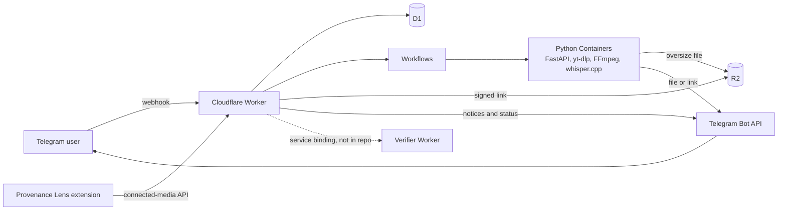

# DigiBot

[](https://github.com/Blimp3/digibot/actions/workflows/ci.yml)
[](https://github.com/Blimp3/digibot/actions/workflows/container.yml)
[](https://github.com/Blimp3/digibot/actions/workflows/secrets.yml)

A personal, invite-only Telegram media assistant on Cloudflare: TypeScript
Worker and Python Container, idempotent delivery, SSRF-safe egress, about 1,300
automated tests.
Send it a public link, or use the companion browser extension, and the video, audio, clip or transcript comes back in your Telegram chat.

## What it does

| Message | Result |
| --- | --- |
| `URL` | Video download (up to 1080p) |
| `/video URL [from 12:00 to 17:00]` | Choose 1080p, 720p, 480p or 360p, optionally trimmed |
| `/audio URL [m4a\|mp3] [first 5 minutes]` | M4A or MP3 audio, optionally trimmed |
| `/clips URL from 00:00 to 00:02; from 00:03 for 2 seconds` | 2–3 clips in one Telegram album |
| `/playlist URL [1-5]`, `/channel URL [1-5]` | The first items of a YouTube playlist or channel |
| `/transcript URL` | Timestamped Markdown transcript (Whisper small, sources up to 15 minutes) |
| `/captions URL [language]` | Publisher or automatic captions as Markdown |
| `/search phrase` as a reply to a transcript | Matching passages with timestamps |
| Reply `/audio` or `/video` to a Telegram file | Convert a file up to 20 MB |
| `/queue`, `/status`, `/stats`, `/activity` | Queue positions, outcomes and recent activity |

Two allowlisted owners, and users they invite for the extension features, can
use the bot, only in private chats. A Telegram
Mini App shows history and statistics. Files above Telegram's upload limit
arrive as a private, signed link that expires after one hour.

## Tech stack

- **Cloudflare:** Workers (TypeScript), Workflows, D1 (SQLite), R2, Containers (through Durable Object bindings), Wrangler
- **Media service:** Python 3.12, FastAPI, Uvicorn, Pydantic, HTTPX, boto3
- **Media tools:** yt-dlp (with yt-dlp-ejs and Deno), FFmpeg and FFprobe, whisper.cpp
- **Telegram:** Bot API (webhooks, multipart uploads, media groups, inline keyboards), Mini Apps
- **Testing and quality:** Vitest with Miniflare/workerd, pytest, mypy (strict), Ruff, ESLint, typescript-eslint
- **Tooling:** pnpm workspaces, uv, Docker (linux/amd64), GitHub Actions

## Architecture



1. The Worker checks the webhook secret, the user allowlist and the URL, then
   admits the request into a durable D1 queue in one transaction.
2. A Workflow, keyed by the job ID, drives the request through retryable
   preparation and one final, non-retried delivery step.
3. The downloader Container probes and downloads the source with yt-dlp, then
   converts and verifies the result with FFmpeg and FFprobe. A second Container
   runs whisper.cpp for transcripts.
4. The result goes to Telegram directly. A file too large for Telegram goes to
   a private R2 bucket, and the user gets a signed, expiring link.

The connected-media API pairs the bot with the
[Provenance Lens browser extension](https://github.com/Blimp3/provenance-lens-extension).
Lens can send a page link to the bot and check images for Content Credentials.
See [docs/architecture.md](docs/architecture.md) and
[docs/integration.md](docs/integration.md).

## Engineering highlights

| Area | Design | Where the tests are |
| --- | --- | --- |
| Idempotency and replay safety | One D1 transaction reserves the Telegram update ID, the user's allowances and the queue entry. In a test, 100 concurrent duplicate updates admit exactly one job. Workflow steps and Container preparation can repeat without a second download or send. | [recovery-d1](apps/cloudflare-worker/tests/recovery-d1.test.ts), [workflow-replay](apps/cloudflare-worker/tests/workflow-replay.test.ts) |
| Delivery reconciliation | Telegram has no upload idempotency key, so the final send is never retried automatically. An ambiguous send is recorded as unknown. A minute-level recovery job uses generation-fenced leases and repairs D1 from confirmed receipts only. `/reconcile` checks the file hash before it records a lost receipt. | [dispatch](apps/cloudflare-worker/tests/dispatch.test.ts), [integration-telegram](apps/cloudflare-worker/tests/integration-telegram.test.ts), [test_telegram](apps/downloader-container/tests/test_telegram.py) |
| SSRF and egress controls | Exact host allowlist with IDNA normalization. URLs with credentials, private, loopback, link-local or metadata addresses are rejected. yt-dlp connects through a local egress proxy that resolves each host and connects only to a public IP, so a DNS change cannot reach an internal address. | [test_egress_proxy](apps/downloader-container/tests/test_egress_proxy.py), [test_security](apps/downloader-container/tests/test_security.py), [url](apps/cloudflare-worker/tests/url.test.ts) |
| Bounded downloads and processes | Limits on duration (2 h), source size (500 MB) and Telegram payload (49 MB, with a re-encode ladder). Subprocesses use argv arrays, absolute deadlines, output caps and process-group kill. Each job has its own workspace, removed after delivery. | [test_workspace_process](apps/downloader-container/tests/test_workspace_process.py), [test_direct_media](apps/downloader-container/tests/test_direct_media.py) |
| Rate limits and queues | Per-user hourly cap, at most five unfinished jobs per user, and separate FIFO lanes for downloads and transcripts. Searches and playlist lookups have their own cooldowns. | [recovery-d1](apps/cloudflare-worker/tests/recovery-d1.test.ts), [webhook](apps/cloudflare-worker/tests/webhook.test.ts) |
| Invitations and pairing | Single-use invitations, pairing with code comparison, rotating refresh tokens with a fixed 30-day session limit, and an exact `chrome-extension://` origin allowlist. Invited accounts get a smaller link-download quota. | [integration-auth](apps/cloudflare-worker/tests/integration-auth.test.ts), [integration-link](apps/cloudflare-worker/tests/integration-link.test.ts) |
| Privacy | Source URLs are stored AES-GCM-encrypted only while a job needs them. Download links are HMAC-signed. Logs carry job IDs, hostnames and stable error codes, never URLs, tokens or Telegram IDs. | [security](apps/cloudflare-worker/tests/security.test.ts), [logging](apps/cloudflare-worker/tests/logging.test.ts) |

**Tests:** 798 Vitest tests in 52 files for the Worker. The D1 tests run
against a local D1 database in Miniflare/workerd. 498 pytest tests cover the
Container, plus the ASR scorer self-check. Two more pytest tests are opt-in and
skipped by default: a live media check and a local whisper.cpp engine check.
The tests use fakes for Telegram, R2, Workflows and the Containers and
make no network calls to media sites. CI also runs ESLint, `tsc`, mypy, Ruff, a
Wrangler dry-run build, Container image builds, dependency audits and a secret
scan. Dated measurements of latency, D1 query costs, encoding and transcription
accuracy are in [docs/measurements](docs/README.md#measurements).

## Repository layout

| Path | Contents |
| --- | --- |
| `apps/cloudflare-worker/` | Webhook, admission, Workflows, Mini App, connected-media API, D1 migrations, tests |
| `apps/downloader-container/` | FastAPI media and transcription service, Dockerfiles, tests |
| `scripts/` | Local development, Telegram webhook setup, dependency updates, secret scan |
| `tools/` | Offline ASR accuracy scorer and its self-check |
| `docs/` | Architecture, security, integration, development, troubleshooting, measurements |

## Run the checks locally

Requirements: Node.js 22.22.2 or newer, pnpm through Corepack (the version is
pinned in `package.json`), Python 3.12 and uv.

```bash
corepack enable
pnpm install --frozen-lockfile
pnpm check   # lint, typecheck, Worker tests, Wrangler dry-run build, secret scan

cd apps/downloader-container
uv sync --frozen --all-groups
uv run ruff check .
uv run mypy src
uv run pytest -q
uv run python ../../tools/test_asr_eval.py
```

`pnpm check:py` runs the same Python steps from the repository root. See the
[development guide](docs/development.md) for local Worker development and
dependency updates.

## Deploying your own

1. Create a Telegram bot with BotFather.
2. Create a D1 database and a private R2 bucket in your Cloudflare account.
   Containers need the Workers Paid plan.
3. Replace the placeholders in
   [`apps/cloudflare-worker/wrangler.jsonc`](apps/cloudflare-worker/wrangler.jsonc):
   `database_id`, `R2_ENDPOINT`, `PUBLIC_WORKER_BASE_URL` and
   `INTEGRATION_ALLOWED_ORIGINS`.
4. Set each secret with `pnpm wrangler secret put <NAME>` from
   `apps/cloudflare-worker`: `TELEGRAM_BOT_TOKEN`, `TELEGRAM_WEBHOOK_SECRET`,
   `INTERNAL_CONTAINER_SECRET`, `ALLOWED_TELEGRAM_USER_IDS`,
   `DOWNLOAD_LINK_HMAC_SECRET`, `R2_ACCESS_KEY_ID` and `R2_SECRET_ACCESS_KEY`.
   `ALLOWED_TELEGRAM_USER_IDS` must contain exactly two distinct numeric
   Telegram user IDs, separated by a comma. Any other value disables the bot.
   Never put secrets in tracked files.
5. First deploy: from `apps/cloudflare-worker`, with Docker running, run
   `pnpm wrangler d1 migrations apply DB --remote` and then
   `pnpm wrangler deploy`. This builds both Container images. Use
   `--containers-rollout none` only for later Worker-only updates.
6. Register the webhook with `scripts/set-telegram-webhook.ts`.

Connected mode calls a separate verifier Worker through the
`PROVENANCE_VERIFIER` service binding. That Worker is not in this repository.
Without it, set `INTEGRATION_ENABLED` to `false` and point the binding at your
own Worker or remove it. The [Worker README](apps/cloudflare-worker/README.md)
has the exact commands.

## What this snapshot is

This repository is a cleaned public snapshot of DigiBot 5.0.0, taken from a
private production repository. It contains the full Worker and Container
source, migrations, tests and CI.

- Real Cloudflare resource IDs, hostnames, extension IDs and the verifier
  service name are replaced with placeholders.
- Internal tooling is left out: the deploy workflow, release and provisioning
  scripts, operations runbooks, the changelog and the Git history.
- This edition ships no provider-specific direct-media resolver. yt-dlp
  handles every source, TikTok and X included.

## Responsible use

Use DigiBot only for media you own, media under an open license, or media you
have permission to download. It does not bypass DRM, paywalls, logins, CAPTCHAs
or private-media controls. You are responsible for following each platform's
terms and copyright law. Report vulnerabilities as described in [SECURITY.md](SECURITY.md).

## Acknowledgements

Built with [Claude Code](https://www.anthropic.com/claude-code), Anthropic's
AI coding assistant, as a development partner for code, tests, reviews and docs.

## License

[MIT](LICENSE) © 2026 Blimp3. Third-party dependencies keep their own licenses.
