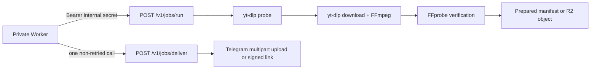

# Downloader Container

This service is the private Worker-to-Container media lane. It accepts an
authenticated prepare request, probes the public source with yt-dlp, downloads
one item into a per-job temporary directory, and verifies the result with
FFprobe. A separate, non-retried delivery request sends a staged file directly
to Telegram or sends a private, expiring R2 link. The container never deletes
the Worker's waiting message; the Worker does that only after delivery is
confirmed.



## Local development

Python 3.12 and uv are required. The lock file is authoritative:

```sh
cd apps/downloader-container
uv sync --frozen --all-groups
uv run pytest
uv run ruff check src tests
uv run mypy src
```

Install FFmpeg/FFprobe and Deno locally, then set explicit paths in the
environment. The image uses `/usr/local/bin/deno` and yt-dlp's pinned default
extra, which installs the matching `yt-dlp-ejs==0.8.0` package. EJS is bundled
at image build time; jobs never fetch EJS code remotely.

```sh
export INTERNAL_CONTAINER_SECRET='use-a-local-random-value'
export TELEGRAM_BOT_TOKEN='placeholder-for-local-integration'
export DENO_PATH=/usr/local/bin/deno
export YT_DLP_PATH="$(command -v yt-dlp)"
export FFMPEG_PATH="$(command -v ffmpeg)"
export FFPROBE_PATH="$(command -v ffprobe)"
PYTHONPATH=src uv run python -m downloader_container --check-dependencies
PYTHONPATH=src uv run python -m downloader_container --serve
```

The dependency command prints paths and versions only. It exits non-zero when
yt-dlp, yt-dlp-ejs, Deno/Node, FFmpeg, or FFprobe is missing or unsupported.

## Container build

The Dockerfile targets Linux amd64, uses Python 3.12 slim, copies the official
Deno 2.8.3 binary to `/usr/local/bin/deno`, installs FFmpeg/FFprobe, and runs as
UID 10001. Build and inspect the health check with Docker:

```sh
docker build --platform linux/amd64 -t private-downloader:local apps/downloader-container
docker run --rm --platform linux/amd64 --env-file apps/downloader-container/.env private-downloader:local python -m downloader_container --check-dependencies
```

For a long-running local server, pass the normal image command and supply
secrets through the runtime environment; do not bake them into an image.

The configured Telegram Bot API and R2 endpoint must be HTTPS origins without
credentials, paths, query strings, or fragments; loopback HTTP is accepted
only for local development. `PUBLIC_WORKER_BASE_URL` is always HTTPS, including
local deployments, because it is embedded in signed links. If Telegram
explicitly rejects a compatible media method with HTTP 400, delivery retries once as
`sendDocument`; an explicit 413 uses one signed R2-link fallback. Network and
5xx failures are not retried through another delivery method.

## API

`GET /health` returns safe dependency diagnostics and never requires a secret.
`POST /v1/jobs/run` requires `Content-Type: application/json` and either
`Authorization: Bearer <INTERNAL_CONTAINER_SECRET>`. Body fields are strict
and camel-cased:

```json
{
  "jobId": "01JEXAMPLE",
  "sourceUrl": "https://youtu.be/example",
  "telegramChatId": "123456789",
  "waitingMessageId": 42,
  "mode": "video",
  "maximumHeight": 1080,
  "preferredFormat": "mp4"
}
```

`/v1/jobs/run` is the retryable prepare phase. A successful response always has
`status=prepared` and identifies the prepared artifact:

```json
{
  "status": "prepared",
  "delivery": "telegram",
  "objectKey": "staged/01JEXAMPLE/example.mp4",
  "filename": "example.mp4",
  "mimeType": "video/mp4",
  "sizeBytes": 1234567
}
```

If the artifact is too large for Telegram, `delivery` is `r2` and `objectKey`
is the private `jobs/...` R2 key. Repeating prepare for the same job is
idempotent while its verified staged artifact is retained, so a lost response
does not download the source twice.

The Worker creates one absolute `JOB_TIMEOUT_SECONDS` expiry for a retryable
workflow before prepare and sends it in the `X-DigiBot-Deadline-At` request
header, leaving the legacy JSON body unchanged. The Container caps that expiry
by its own local policy so an input cannot extend the deadline and returns it as
`deadlineAt`; staged manifests retain the same value. A request without the
header starts its own local deadline. Delivery uses the earliest expiry from the
manifest, header, or direct-service request, so its probes, source requests,
subprocesses, verification, upload, retries, and termination grace period
consume the remaining budget.
Older images ignore the header and therefore cannot enforce a shared deadline
across prepare retries; older manifests and Worker delivery payloads without
this field use the local delivery cap as an explicit compatibility fallback.
A staged manifest is local ephemeral state: if it is missing after a restart,
delivery fails safely without replaying or sending.

When a direct-media resolver returns a validated H.264 MP4 CDN URL no larger
than `TELEGRAM_URL_LIMIT_BYTES`, prepare uses `delivery=telegram_url` and
returns an opaque `staged/<job-id>/remote.mp4` key. No resolver ships in this
edition (`resolve_direct_media` returns `None`), so yt-dlp handles every
source, TikTok and X included; the path below remains for a resolver that uses
a documented provider API. The expiring provider
URL is retained only in the mode-0600 private manifest; it is never returned
to the Worker or written to logs. Delivery revalidates that URL and asks
Telegram to fetch it with JSON `sendVideo`, avoiding a container download.
If Telegram explicitly rejects that URL with HTTP 400, the container performs
one bounded local download, FFprobe verification, and multipart upload. Other
Telegram/network failures are not retried through a second path.

After prepare succeeds, the Worker calls `/v1/jobs/deliver` exactly once (no
retry) with the legacy JSON fields and, for newer Workers, the optional
`X-DigiBot-Deadline-At` header. For a staged Telegram artifact, the Container
re-verifies it, sends a direct multipart request, and removes the retained job
directory only after Telegram confirms the message. For `deliveryMode=r2`, it
does not assume a local job directory: it creates the signed R2 URL and sends
that link. A
successful delivery response has `status=completed` and a string
`telegramMessageId`. The Worker owns waiting-message deletion after this
response. On failure, the Worker keeps and edits the waiting message, while
the Container removes any retained staged artifact because delivery is never
retried.

Both phases return stable `status=failed` responses containing `errorCode`, a
short `safeMessage`, and `retryable`. Delivery also includes `outcome`, which
is `rejected` only when Telegram definitively rejected the send and
`ambiguous` when the provider may have accepted it. Raw yt-dlp, FFmpeg,
Telegram, and Python errors are never returned. A confirmed rate limit that
does not fit the current request can also include its validated full delay as
`retryAfterSeconds` for durable Worker scheduling.

## Operational limits

The defaults are deliberately conservative: one active job, 2,048-character
URLs, two hours of media, 500 MB source/download size, one media item, and a
49,000,000-byte Telegram upload target. Files larger than the target are
re-encoded with H.264/AAC (or a bounded audio bitrate ladder); files that still
do not fit use private R2. R2 links default to one hour and should be paired
with an R2 lifecycle rule for deletion after 24 hours.

## Updating yt-dlp safely

Update `yt-dlp[default]`, the matching `yt-dlp-ejs`, and the lock file together.
Then run all tests, the dependency diagnostic, and a manually supplied
opt-in live test outside CI. Do not enable `--remote-components` in production.
Review the compatibility pin in yt-dlp's `pyproject.toml` before changing EJS.

References: [yt-dlp EJS guide](https://github.com/yt-dlp/yt-dlp/wiki/ejs),
[yt-dlp options](https://github.com/yt-dlp/yt-dlp/blob/master/README.md), and
[Deno Docker images](https://github.com/denoland/deno_docker). No account
cookies are used.

## Source captions

The caption path accepts `operation=transcript`,
`transcriptMethod=captions` and optional `captionLanguage`. It runs on the
ordinary downloader Container and source admission lane, using the existing
public-source/egress validation and total job deadline (1,200 seconds by
default). The full source must be at most 900 seconds; trim arguments do not
apply. This path does not run or modify the separate Whisper backend.

Caption selection prefers publisher tracks over original automatic tracks
within the selected language match, with exact language first and compatible
base-language fallback only. An explicit region is never replaced by another
region. Translated tracks are excluded, and unavailable captions/languages
return errors without speech-recognition fallback. The bounded VTT, SRT and
JSON3 parser writes the shared timestamped Markdown format with `Method` and
`Language`; provider-wide caption availability is not established by the tested
fixtures.

Caption documents retain the 2,000,000-byte bound, staged manifest and SHA-256
verification, direct Telegram document delivery and temporary workspace
cleanup. They have no R2 fallback. Reply-to-file `/search` runs entirely in the
Worker and never sends attached transcripts to this Container. See the
[captions and search record](../../docs/measurements/captions-search.md) for
the live caption checks.

Caption-only metadata probing permits missing media formats so public caption
tracks can still be fetched. This resolved the first live YouTube caption
failures and passed a fresh Telegram retest. Download and Whisper metadata
probes remain strict; no cookies, alternate egress or Whisper fallback were added.

## Media tools

The quality path caps actual video output height and never upscales.
The Worker supplies the selected ceiling; Automatic is at most 1080p by default.
`JobRunRequest` accepts exactly one URL or typed `telegramFile` source. Telegram
inputs are at most 20,000,000 bytes, resolve through fixed-origin `getFile` only
at execution and download without redirects into the private workspace.
Filename/MIME screening is only an initial hint. Signature checks and FFprobe
verify the actual format/streams: MP4-family containers, WebM/Matroska, Ogg,
MP3, WAV, FLAC and MPEG-TS are the allowed input containers. Unsupported
containers, photos, playlists, archives and local-reference inputs are blocked. Conversion emits verified M4A/AAC, MP3 or H.264/AAC MP4,
removes the source input before retaining staged output, and uses the existing
49,000,000-byte single-output delivery budget/private-R2 fallback. File inputs
are not a transcript feature or permanent archive and do not reuse a cross-job
media cache.

Clip packs: download one source, prepare 2–3 requested
MP4 clips in order, cap each at 120 seconds and all requested durations at 300
seconds, disclose source-end clamping and reject requested ranges or effective
clamped ranges that duplicate each other, while allowing overlaps. The quality ceiling and one processing deadline cover the whole pack.
Before delivery, enforce an aggregate 49,000,000-byte multipart budget with a
64 KiB reserve, equal per-clip media allocations and an exact HTTPX multipart
`Content-Length` check. A lower configured upload ceiling also applies; equal
allocations can reject uneven packs even when another clip has spare bytes. Stage/verify all clips before one native Telegram album call. A complete
ordered receipt confirms success; an incomplete/ambiguous result holds the
whole job unknown with no automatic resend/fallback, including during recovery.
Album rate-limit rejection is not deferred or retried. No ZIP or AI selection.

Selected-height video, MP3/M4A file conversion and ordered native albums
passed actual Telegram and saved-file full-decode checks; see the
[media tools evidence](../../docs/measurements/media-tools.md).
