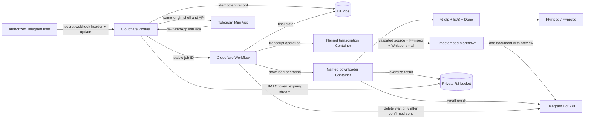

# Architecture

## Scope

This repository implements one private Telegram downloader. The Telegram entry point uses a Cloudflare Worker for authentication and orchestration, a Workflow for durable state transitions, and separate private Container instances for media downloads and speech transcription. This guide describes the request path, queues, captions, file search, Mini App and delivery contracts. Dated runtime and live-test evidence is in the [measurements](README.md#measurements). It is not designed as a public service.



## Telegram request path

1. `POST /telegram/webhook` validates method, content type, size, secret header, numeric user allowlist, private chat, command shape, rate limits, and the normalized initial hostname.
2. One D1 transaction reserves the unique `telegram_update_id`, the authenticated user's unfinished-request allowance, the separate per-user hourly admission, and a durable FIFO job entry. New admissions are always queued; no active lane slot is consumed here. Concurrent webhooks therefore cannot overbook the configured capacity.
3. The same admission transaction saves the queue acknowledgment receipt with the job before returning HTTP 200. A short background webhook dispatch and minute recovery send that receipt using the stable job ID. The Workflow reuses the receipt and may cosmetically edit it to `Preparing` before media processing; it does not send a second queue acknowledgment. Business rejections use a durable notice outbox.
4. The Workflow calls `/v1/jobs/run` for retryable preparation. The Container validates the authenticated request again, creates `/tmp/media-jobs/<job-id>/`, probes before downloading, enforces limits, and verifies the output with FFprobe. For a transcript, the separate Container prepares audio, runs Whisper, validates timestamped UTF-8 Markdown, and removes the source media. The Workflow creates the preparation deadline only at the preparation checkpoint after the durable queue notice is observed; queue wait and any waiting-notice delay, including Telegram 429 backoff, are outside that deadline. This phase performs no Telegram send.
5. A compatible file is retained with an operation-bound manifest and SHA-256 for delivery; an oversize media download is written directly to private R2. Transcripts are limited to 2 MB and use direct Telegram document delivery only. Repeating preparation with the same job ID resumes the verified staged result or safely overwrites the deterministic R2 key.
6. The Workflow calls `/v1/jobs/deliver` as a separate non-retried step. The Container sends one direct multipart upload or one signed R2 link. Only an explicit Telegram 400 permits one `sendDocument` fallback, and only an explicit 413 permits an R2-link fallback for media downloads; transcripts already use `sendDocument` and have no second-send or R2 fallback; ambiguous network/5xx upload results are not resent.
7. Only after Telegram confirms the final message does the Workflow persist completion and then delete the preparation status in separate idempotent, retryable steps. A pre-delivery failure keeps and edits the temporary message; post-delivery bookkeeping never resends the media.

## Source catalog and Mini App history

The source catalog is deliberately narrower than an extractor's hostname
recognition. The runtime catalog retains conservative verification labels. The `/sources` Telegram command and the authenticated
`GET /api/sources` route share these states:

| State | Current implementation |
| --- | --- |
| Verified | YouTube public videos and Instagram public Reels are the catalog entries labeled verified. |
| Recognized/unverified | YouTube Music, TikTok, X/Twitter, Vimeo, Reddit, Pinterest, and TED remain labeled recognized/unverified in code. Do not interpret a successful fixture as provider-wide support. |
| Intentionally unsupported | Protected/private, login-gated, age-gated, DRM, CAPTCHA, paywalled, or unauthorized content. The bot does not bypass access controls. |

The canonical Mini App shell is `GET /apps/downloader`; it loads versioned
same-origin CSS and JavaScript assets. Its canonical private API surface is:

| Route | Contract |
| --- | --- |
| `GET /api/apps/downloader/sources` | Return the shared three-state source catalog. |
| `GET /api/apps/downloader/history` | Return a bounded, keyset-paginated projection of the caller's history. |
| `DELETE /api/apps/downloader/history` | Clear only the caller's terminal (`completed`/`failed`) history rows. Active jobs remain. |
| `DELETE /api/apps/downloader/history/:id` | Delete one caller-owned terminal row. |

The legacy `/mini-app`, `/mini-app.css`, `/mini-app.js`, `/api/sources`, and
`/api/history*` paths remain exact downloader aliases. Canonical assets use
verified content-hash prefixes and immutable cache headers; legacy assets,
HTML, and authenticated API responses remain `no-store`.

For every `/api/*` request, the Worker takes only raw
`Telegram.WebApp.initData` (sent as `Authorization: tma ...`) as identity
input. It validates Telegram's bot HMAC, rejects data older than five minutes
(and data beyond the small future-skew bound), and checks the signed numeric
user ID against `ALLOWED_TELEGRAM_USER_IDS`. It never consults
`initDataUnsafe`, a client user-ID header, or any other caller-selected
identity. Every history read and delete is constrained by that authenticated
user ID in D1.

The history projection is intentionally minimized to:

```text
historyId, provider, safeLabel, mediaType, status, requestedMode,
createdAt, completedAt, sizeBytes, fileAvailability
```

The projection also adds safe `task` and `outcome` labels, with the
filtered summary/window contract described below.

It does not return the full source URL, source URL hash, Telegram IDs, R2
object key, internal error data, or a retrieval link. The source URL is
encrypted in D1 only while processing requires it and is cleared at a terminal
state. The non-reversible `source_url_hash` reuse key is keyed HMAC-SHA-256
using `INTERNAL_CONTAINER_SECRET`.

Completed results in R2 are temporary. `expires_at` controls availability;
scheduled cleanup deletes the expired object first and clears its pointer while
retaining the D1 history row and its expired metadata. Per-item and clear
deletion use the same order—R2 object first, then the user-scoped D1 row—and
only terminal rows are deletable. The implementation uses existing `jobs` columns
and indexes (including the user/time history index); no new schema migration is
needed.

`/stats` counts a job as confirmed only when it has a validated delivery
receipt; see [Stats and activity](#stats-and-activity). A historical result
message ID alone is not proof of confirmation.

This architecture guide does not substitute for live Telegram/R2 evidence.
This repository does not manage BotFather Mini App configuration. The native
Activity button has type `web_app`, label `Activity` and the same-origin
`/apps/downloader` target. The Telegram help text includes `/stats` and
`/activity`.

## Mini App runtime boundaries

The immutable runtime registry contains only the downloader. It owns
`/apps/downloader`, `/api/apps/downloader/*`, the `jobs` D1 namespace, the
`jobs/` R2 prefix, and the download-recovery-and-retention background policy. Registry,
route, method, and asset maps are built and frozen at module load. Duplicate
IDs, routes/assets, D1 namespaces, R2 namespaces, and observability names fail
closed before the Worker can serve traffic.

The composition root parses each URL once and resolves the exact route and
method before any authentication work. Protected APIs verify Telegram raw
`initData` once, then explicitly authorize that identity for the selected app.
The resulting immutable principal is scoped to one app. The downloader's
repository is also bound to that principal's user ID and validates the fixed
`jobs/<job-id>/...` R2 namespace internally; history handlers never receive raw D1
or R2 bindings and cannot supply a different user ID. The separate owner-only
diagnostics handler returns sanitized aggregate counts and bounded R2 orphan
inspection, without per-user records or object keys.

Existing `/mini-app`, `/mini-app.css`, `/mini-app.js`, `/api/sources`, and
`/api/history*` routes remain exact downloader aliases. Canonical CSS and
JavaScript paths contain verified SHA-256 prefixes and return immutable cache
headers. Canonical and legacy asset bytes remain identical; legacy assets,
HTML, and authenticated API responses remain `no-store`. Similar prefixes,
duplicate slashes, encoded separators, unknown apps, and unlisted methods do
not fall through to an app handler.

History pages select only the columns in `HISTORY_LIST_COLUMNS` instead of
materializing a full `jobs` row, while preserving the same user filter, keyset
cursor, order, null handling, and response shape. Local `EXPLAIN QUERY PLAN` verification
uses `idx_jobs_user_created`; SQLite still reports a temporary B-tree for the
final `id` tie-breaker. A composite index is not added until it is
benchmarked on representative data.

## Worker status, retention, and delivery boundaries

`GET /health` is liveness-only. It retains `ok`, `service`, and `version`, and
returns Cloudflare's immutable `versionMetadata` object with the Worker version
`id`, deploy `tag`, and upload `timestamp`. Bounded `GET /ready` performs only
`SELECT 1` against D1; it returns HTTP 503 when that check fails and does not
probe the Workflow, Container, or R2.

Dispatch and receipt recovery run every minute; R2 retention runs separately every 15 minutes. Expired job cleanup deletes a
private R2 object before conditionally clearing its D1 pointer, retries safely
on a later run when either operation is unavailable, and retains the D1 history
row and expired metadata. The bucket lifecycle rule is defense in depth.

Telegram message creation is non-idempotent. Worker status calls retry only an
explicit HTTP 429, or a body-level 429 in HTTP 2xx with a valid positive
`retry_after`; valid delays above the bounded in-request budget are not
shortened or held open by the Worker. Network/5xx failures, malformed or
missing confirmations, and other ambiguous outcomes are never resent. Final
media delivery is a separate non-retried Workflow step; explicit 400 and 413
responses alone permit the documented `sendDocument` and private-R2 fallbacks.

## Deployment checklist

Use this list when you deploy your own instance:

1. Confirm the Worker origin, D1 database, private R2 bucket, Container
   bindings, Workflows and cron triggers in `wrangler.jsonc`.
2. Set the secrets in Cloudflare, never in tracked files:
   `TELEGRAM_BOT_TOKEN`, `TELEGRAM_WEBHOOK_SECRET`,
   `INTERNAL_CONTAINER_SECRET`, `ALLOWED_TELEGRAM_USER_IDS`,
   `DOWNLOAD_LINK_HMAC_SECRET` and the R2 credentials. Set
   `PUBLIC_WORKER_BASE_URL` to the HTTPS Worker origin.
3. Apply the migrations in `apps/cloudflare-worker/migrations`. Numbers `0003`
   to `0007` belonged to a retired feature and are intentionally absent; never
   reuse them. Migration 0015 adds the five-unfinished-job guard, its index and
   the dispatch-lease trigger; it does not add a queue table or a Cloudflare
   Queue.
4. Deploy compatible Container images before the Worker that depends on them,
   and check Container health separately from Worker health.
5. Add an R2 lifecycle rule that expires `jobs/` objects, as a backstop for the
   scheduled cleanup, which deletes each object before it clears the D1 pointer.
6. If you enable the Mini App in BotFather, check that missing, stale, tampered
   and unallowlisted `initData` is rejected, and that `initDataUnsafe` and
   client ID headers have no effect.
7. With an allowlisted account, exercise the source catalog, history
   pagination, single-item delete, terminal-only clear, cross-user isolation
   and expired-metadata retention.

## Data lifecycle

- D1 stores numeric Telegram identifiers as strings, a keyed source URL HMAC, safe state, output metadata, and a short-lived encrypted/protected URL only while work requires it.
- Full source URLs and signed download links are excluded from structured logs.
- Preparation failures remove their working directory. A verified direct-upload artifact is intentionally retained between `/run` and `/deliver`, removed after confirmed delivery or terminal delivery failure, and eligible for startup stale-directory cleanup after 24 hours if execution is interrupted. Cleanup failures are logged; normal Container sleep discards its ephemeral disk, but continuous activity can postpone sleep.
- R2 objects use `jobs/<job-id>/<safe-filename>` and are deleted by scheduled cleanup and a bucket lifecycle policy.
- The R2 bucket has no public access. `/download/:token` verifies signature and expiry before streaming one bound object.

## Capacity model

The checked-in configuration uses one `standard-1` downloader and one `standard-3` transcription Container, each named with `max_instances: 1` and roughly five-minute idle sleep. Atomic D1 admission permits one active download and one active transcript concurrently; durable waiting queues hold further requests for each lane. Both operations share the configured per-user hourly allowance. The checked-in `wrangler.jsonc` sets 20 accepted jobs per user per hour; the code default is 5. Speech recognition does not consume the downloader slot, but the services still share Worker orchestration, D1 and Telegram delivery infrastructure.

The transcription Container has two CPUs and 8 GiB memory, runs multilingual Whisper small on CPU with two threads and upstream runtime-selected kernels, and accepts sources up to 900 seconds with a persisted 1,800-second total deadline. The native comparison measured 19.795 seconds (RTF 0.975) on the 20.310125-second fixture at this setting, versus 46.833 seconds (RTF 2.306) on standard-2 with one thread. Ordinary media retains a 1,200-second job deadline and a 7,200-second source ceiling. Admission limits are not latency promises.

## Request queue

Each owner or invited account may have at most five unfinished requests,
counting running and waiting work. With the two-owner allowlist, Telegram commands
allow ten in total; each invited account's Lens link downloads add up to five
more, queued with ordinary downloads. Ordinary downloads
and source captions share one durable FIFO lane; Whisper transcripts use a
separate durable FIFO lane. When a lane completes a job, it promotes its
oldest waiting request. The minute recovery also promotes or dispatches waiting
work when an earlier handoff was missed.

Waiting jobs have no automatic queue timeout. Their source URL remains
encrypted/protected in D1 while it is needed for preparation; terminal
completion or failure clears it, and no plaintext URL or transcript content is
archived. The five-request unfinished bound is separate from the per-user
hourly cap. The acceptance notice reports the position when accepted;
`/queue` shows only the requesting user's unfinished jobs and current
positions, and `/status` reports the latest job's current position. Aggregate
counts refer to the same lane without exposing other-user details. There is no
cancel, reorder or priority UI.

Preparation deadlines begin when work starts after promotion and exclude queue
wait. An unknown Telegram delivery outcome retains the active lane slot for
operator review; it is not automatically released or resent.

## Transcript contract

`/transcript URL` accepts one full source, without output-format or trim arguments. The source title names a downloadable Markdown document that users can search locally; it contains an explicit automatic-transcription method, source metadata and timestamped paragraphs. Its Telegram caption contains a short preview capped at 600 characters. There is no server-side transcript library, translation, OCR, or cross-transcript search.

The same authenticated source validation, public-egress checks, download limits and process deadlines apply inside the dedicated backend. The Worker removes all R2 credentials and link-signing configuration from that role. Model weights, code, binaries and dynamic CPU libraries are root-owned and nonwritable by the runtime user. Whisper runs from its trusted executable directory because its upstream backend loader also searches the working directory.

Source audio and intermediate files are removed after document staging; the document is removed after delivery or terminal failure, with the same 24-hour startup stale-workspace fallback and ephemeral-disk limits described above. The artifact's SHA-256 and operation are rechecked on resume/delivery. Telegram retains the delivered file according to its own chat behavior; no separate transcript archive is created on Cloudflare. See [transcription measurements](measurements/transcription.md) for evidence and sample limitations.

## Source captions and file search

`/captions URL [language]` uses `requested_operation=transcript` with
`transcript_method=captions` and optional `caption_language`. Migration 0014
adds these fields without changing existing Whisper rows. Caption jobs share
the source admission lane and downloader Container, with the ordinary
`JOB_TIMEOUT_SECONDS` preparation deadline (1,200 seconds by default) created
at the preparation checkpoint after the durable queue notice is observed;
queue wait and waiting-notice delay, including Telegram 429 backoff, are
excluded. Their full-source duration ceiling remains 900 seconds. They
produce the same bounded Markdown artifact and use its integrity checks, direct
document send and cleanup; caption documents never fall back to R2.

Selection prefers publisher-provided captions over original automatic captions
within the requested language match. Exact language wins first; a regional
request can use a generic base track, and a base request can use a regional
track, but one explicit region is not replaced by another. Without a language,
the available publisher track preference applies. Translated tracks are
excluded; missing captions or language produce an explicit error rather than
Whisper fallback. Documents include `Method` and `Language`. Valid subtitle
display tails are clipped to the source duration. The [local source checks](measurements/captions-search.md)
do not establish caption support across a whole provider.

`/search phrase` replies to a DigiBot-format `.md` document in the current
allowed user's private chat, including a saved and reattached copy. The Worker
validates the file metadata, downloads at most 2,000,000 bytes using Telegram's
fixed API origin, and parses bounded UTF-8 Markdown in memory. A 1–200-character
phrase matches within one segment using NFKC, lowercase and whitespace
normalization. Output preserves original text, merges neighboring context,
reports zero/truncated results and stays below 3,500 characters. Plain
passage timestamps do not imply word alignment; source labels are not timed
URLs. `Method (file metadata)` acknowledges that the attached file is editable.
There is no fuzzy or semantic engine.

Search bypasses jobs, Workflows, Containers and the durable notice outbox for
result delivery. Its atomic `processed_updates` claim adds only update ID,
user ID and receipt time, with no job ID, file identifier, file bytes, query or
result text. Existing seven-day receipt cleanup applies. Per-user admission
requires at least 30 seconds between searches and reuses `MAX_JOBS_PER_HOUR`
as a separate search count. The one-shot plain-text send is not automatically
repeated after an uncertain result. Telegram retains the user's attachment
and the response according to its own chat behavior; Cloudflare creates no
transcript archive or search index.

The [captions and search record](measurements/captions-search.md)
distinguishes live checks from local fault regressions.

## Durable dispatch and confirmation

Queue admissions atomically write the update reservation, queued job, queue
acknowledgment receipt, dispatch intent, and delivery state. Active lane
admission is acquired separately by atomic promotion; only the job ID enters
Workflows. One-minute recovery claims pending intents with a generation fence
and uses the same Workflow ID.
Unknown sends retain their admission and lane slot and require operator review;
a lease or Workflow age cannot authorize a resend. Confirmed receipts repair D1 completion
from the supported Workflow result without repeating Telegram delivery.

Business rejections and ordinary commands use a durable notice outbox before HTTP 200.
Admitted file-search results use the one-shot memory-only path described above.
Queue acknowledgment notices use the receipt written at admission; the
webhook or minute recovery sends it, and the Workflow reuses it with only a
cosmetic `Preparing` edit while preserving explicit long Telegram rate-limit
delays. Status distinguishes known delivery
from uncertain outcomes. Cache validity is separate from confirmed history,
and cache reuse includes owner, chat, source identity, mode, quality, and policy.

## Quality selection, file conversion and clip packs

Quality selection, replied-file conversion and clip packs are described below.
See the [media tools record](measurements/media-tools.md) for the tested
fixtures.

Explicit `/video URL [timing]` and replied `/video [timing]` persist a private
quality prompt, encrypted source and opaque one-use callback choices in D1.
Choices are Automatic (up to 1080p by default), 720p, 480p, 360p and Cancel,
filtered by the configured ceiling. Prompts expire after ten minutes; a new
prompt supersedes the user's previous one. Authorized selection atomically
consumes the prompt and admits one job under the existing queue/hourly limits.
Cancel applies only to the prompt. Bare URLs retain immediate automatic
admission. The Container enforces the requested maximum height without upscaling.

A sent/forwarded attachment only returns instructions. An authorized private
chat reply `/audio [m4a|mp3] [timing]` or `/video [timing]` selects one video,
audio, voice message or audio/video document up to 20,000,000 declared and
streamed bytes. Message captions and forwarded sender metadata grant no
additional authority. Photos, stickers, animations, video notes, albums and
archives are excluded; actual format/streams are probed before conversion,
and playlist or local-reference inputs are rejected. The encrypted queued
source descriptor is resolved through fixed-origin Telegram `getFile` only
when the job runs. The Container removes the input after preparing verified
output. These jobs do not reuse a cross-job media cache or create an input
archive. Single-output delivery retains the 49,000,000-byte budget and existing
private-R2 fallback.

The `/clips` command accepts a URL or replied media plus 2–3
semicolon-separated ranges using existing timing grammar. Requested order is
preserved; overlaps are allowed, duplicate requested ranges or ranges made
identical by source-end clamping are rejected. Limits are 120 seconds per clip
and 300 seconds aggregate. One source download, admission,
hourly charge, queue slot and processing deadline cover all MP4 clips. Source
end clamping is disclosed. The same picker caps each clip's height.

All clips must be verified and staged before one native Telegram album call.
The aggregate budget is 49,000,000 bytes including multipart overhead: reserve
64 KiB, allocate the remaining media budget equally per clip, then check the
actual HTTPX multipart `Content-Length` before sending. A lower configured
upload ceiling also applies. Success requires the complete ordered
message-ID receipt throughout delivery and recovery; incomplete or ambiguous delivery leaves the whole job unknown without
automatic resend or fallback. Album rate-limit rejections are not automatically
deferred/retried. There is no ZIP or automatic moment selection.

Rollout order: compatible Container images first, then the additive
migrations `0016_video_quality_prompts.sql`, `0017_telegram_file_sources.sql`
and `0018_clip_packs.sql`, then the Worker and the webhook `callback_query`
registration.

## Stats and activity

This Worker/Mini App feature uses existing D1 job/delivery metadata and no
external analytics service. The native Activity button opens the authenticated Mini App at the
same-origin `/apps/downloader` target.

### Windows, units and outcomes

`/stats` defaults to `7d`; optional periods are `24h`, `7d`, `30d` and `all`.
Durations roll backwards from a server UTC `asOf`, not calendar days or the
viewer's timezone. Cohort membership uses inclusive `job.created_at` bounds:
`since <= created_at <= asOf`; `all` has no lower bound and means all retained
accepted jobs. An accepted job remains in its acceptance-time cohort even if
it completes later. Outcomes are the current recorded state, not the state at
acceptance or an immutable historical status snapshot.

Every retained job belongs to exactly one category:

| Outcome | Evidence rule |
| --- | --- |
| Confirmed | A valid confirmed delivery receipt using `telegram`, `telegram_url` or `r2`; clip packs require the complete validated ordered receipt. |
| Failed | A recorded failure without a conflicting/unknown delivery state requiring review. |
| Unfinished | Work still in progress without a condition requiring review. |
| Needs review | Missing, malformed, unknown or inconsistent confirmation evidence, including completed legacy rows supported only by a result message ID. |

Task/source breakdowns include confirmed jobs only. Task labels distinguish
video, audio, image, other media, Whisper, source captions and clip packs;
Telegram inputs are labeled Telegram file. A clip pack is one accepted and
confirmed job; validated delivered clips are a separate count. Search receipts
are not media jobs and do not contribute to these counts. No number represents
a cache-hit rate, latency, throughput, bill or cost saving.

`/activity` returns the latest five retained accepted jobs across all retained
time, with safe task/source labels, UTC time and current outcome. It does not
expose IDs, URLs, queries or filenames. The authenticated Mini App may retain
opaque identifiers internally for owner-scoped deletion; those are not an
activity-message field or a source retrieval link.

### Mini App filtering and consistency

Period defaults to Last 7 days; task defaults to All tasks. The history API
returns a bounded page and a summary over **all** matching retained rows,
not just the visible page. Page and summary share the same period, task and
frozen server-UTC `asOf`; the keyset cursor carries that window and position.
Changing cursor filters is rejected. Loading more continues that acceptance
window, while refresh or filter changes start a new window.

Friendly task/outcome labels and a UTC snapshot time explain the results.
Controls are disabled while loading. Filter changes reset prior rows/summary;
failed reads show an error rather than partial totals. This is stable cohort
pagination, not a transactional database snapshot: outcomes or deletions can
change while pages are read. A successfully completed Delete/Clear refreshes
rows and summary; a failed deletion refreshes and warns that some finished
activity may already have been removed rather than claiming nothing changed.

### Retention and deletion

Job activity metadata remains until its owner explicitly uses Delete or Clear.
Delete removes one owner-owned finished (`completed`/`failed`) row. Clear asks
for confirmation and removes **all** that owner's finished rows, regardless of
period/task filters; unfinished jobs remain. Counts change as rows are actually
removed. Temporary R2 objects are removed before their history rows, preserving
existing failure handling. Their independent TTL is unchanged: expired files
do not imply expired activity metadata.

This is not total data erasure. Deletion does not remove Telegram messages or
separate replay/outbox records. Source inputs continue to be cleared at terminal
state, search admission receipts retain their existing seven-day cleanup, and
no permanent transcript, query or excerpt archive is introduced. Unknown
outcomes never authorize a resend, and the existing two-user private-chat gate
and owner-scoped reads/deletes remain in force.
